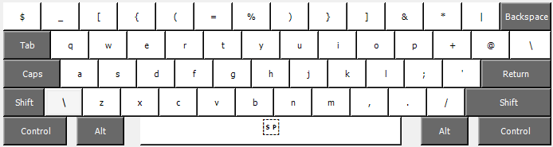
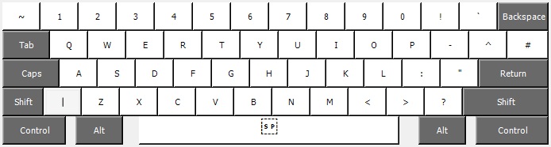

# keyboard-layout
##linux
```
cp nimaslayout >> ~/.config/xkb/nimaslayout
```
Then you have to update the `sudo vim /usr/share/X11/xkb/rules/evdev.xml` with the following, add it near the other English keyboards.
```
<variant>
    <configItem>
        <name>nimaslayout</name>
        <description>English (nimaslayout)</description>
        <vendor>nima</vendor>
    </configItem>
</variant>
```

## windows
download keyboard layout creator
Project > build DLL and setup package


# layout
Normal mode


Shift mode

